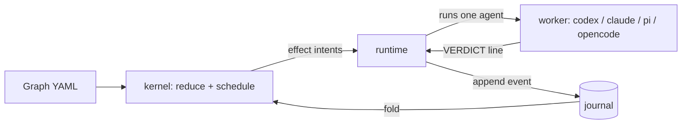

# hex

**Run the coding-agent CLIs you already use in bounded, resumable, journaled loops.**

## Install

macOS and Linux (arm64 and x86_64). On Windows, use WSL.

```sh
curl --proto '=https' --tlsv1.2 -LsSf https://github.com/k4black/hex/releases/latest/download/hex-cli-installer.sh | sh
brew install k4black/tap/hex-cli
uv tool install hex-agents-cli   # or: pipx install hex-agents-cli
npm install -g @k4black/hex-cli
cargo binstall hex-cli           # or: cargo install hex-cli
mise use -g github:k4black/hex
```

## Setup

Run these from the repository root:

```sh
hex init            # creates .hex/, a project config, ~/.config/hex/config.yaml
hex doctor          # checks that agent CLIs, models and checks are usable
hex skill install   # installs the /hex skill for your agents
```

- `hex skill install` writes `~/.claude/skills/hex` and `~/.agents/skills/hex`.
  hex keeps the skill in sync with the binary.
- Alternative: `npx skills add k4black/hex`.

## First run

```sh
hex run critique-loop -p "fix the flaky auth test"
```

- One agent implements. A different model reviews. The loop stops when the reviewer approves or a bound runs out.
- `hex run` blocks. To watch from another terminal:
  - `hex runs` lists runs and their ids.
  - `hex status <run>` shows the current node, the in-flight attempt and the spend.
  - `hex logs <run> --follow` streams the agent output.
  - `hex steer <run> "use the v2 API"` guides the next attempt.
- Ctrl-C pauses the run. `hex resume <run>` continues it.
- `hex list` shows the presets. `hex graph <preset>` shows one.
- Exit codes: `0` succeeded · `1` failed · `2` usage or config error · `3` timed out · `4` budget exhausted · `5` cancelled · `6` paused.

## Supported agents

- Codex (`codex`)
- Claude Code (`claude`)
- pi (`pi`)
- opencode (`opencode`)
- Any other CLI through a `kind: command` worker.

## Customize

Config layers deep-merge per key: built-in, then `~/.config/hex/config.yaml`, then `.hex/config.yaml`.

**Graphs.** A graph is one YAML file. A file in `.hex/graphs/<name>.yaml` overrides a preset of the same name.
Copy a preset to start: `hex graph critique-loop --format source > .hex/graphs/my-loop.yaml`.
Check it with `hex validate my-loop`.

<!-- A loader test requires the first yaml block in this file to be a valid graph. -->
```yaml
version: 1
name: fix-until-green
entry: implement
defaults: { role: implementer }
nodes:
  implement:
    agent: { prompt: "{{prompt}}", context: continue }
    on: { done: test }
  test:
    command: { check: test }
    on: { passed: done, failed: implement }
  done:
    terminal: succeeded
accept:
  require: [test.passed]
```

**Checks.** A check says what "green" means in this project. The list is empty by default.
A graph that names an undeclared check does not start.

```yaml
checks:
  test: [cargo, test, --workspace]
```

**Roles.** A graph names a role. A role binds a worker, a model and an effort.
By default claude implements and codex reviews, each on its CLI's default model.

```yaml
roles:
  implementer: { worker: claude, model: claude-opus-5, effort: high }
  reviewer:    { worker: codex, model: gpt-6-sol }
```

---

## How it works



- **The journal is authoritative.** Each state change is an append-only event.
  hex computes the current state from the journal. `resume` rebuilds a run from it after a pause or a crash.
- **Routing is deterministic.** An agent with several outcomes ends its final message with `VERDICT: <signal>`.
  The signal must be in the node's `may_propose` list. Edges pick the next node. Routing spends no tokens.
- **Every loop is bounded.** Each node has a visit bound (default 5). Each attempt has a time bound (default 30m).
  The run also has elapsed and output-token bounds.
- **Gates decide "done".** An agent's "done" is a proposal. `accept.require` names the evidence a success needs,
  for example `[test.passed]` or `[review.approved]`.
- **Two verbs execute.** `run` starts a new run. `resume` continues the same run. To redo work, start a new run.
- Four node kinds: `agent`, `command`, `human`, `terminal`.

Status: the core loop works and runs on this repo. [TODO.md](TODO.md) lists what is open.

---

## Contributing

```sh
cargo build --workspace
cargo test --workspace
cargo clippy --workspace --all-targets
cargo fmt --all
```

- Open PRs against `main`. Use [Conventional Commits](https://www.conventionalcommits.org/) for titles and commits.
- release-plz automates releases. See [docs/releasing.md](docs/releasing.md).
- [AGENTS.md](AGENTS.md) describes the architecture, the core rules and the terminology.
