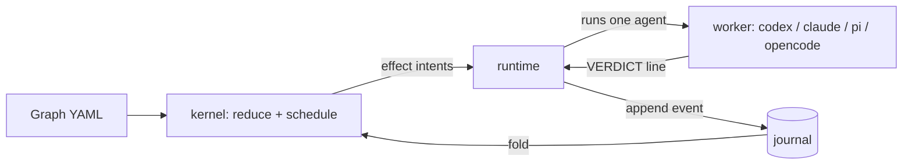

# hex

**Run the coding-agent CLIs you already use in bounded, resumable, journaled loops.**

hex is simple and minimal: one binary, no server, no framework.
It is a thin loop runner around the agent CLIs you already use.
A loop is a small YAML graph: one agent implements, a different model reviews, your tests decide "done".

## Install

You can install hex with any of these methods:

```sh
curl --proto '=https' --tlsv1.2 -LsSf https://github.com/k4black/hex/releases/latest/download/hex-cli-installer.sh | sh
brew install k4black/tap/hex-cli
uv tool install hex-agents-cli   # or: pipx install hex-agents-cli
npm install -g @k4black/hex-cli
cargo binstall hex-cli           # or: cargo install hex-cli
mise use -g github:k4black/hex
```

- Platforms: macOS and Linux, arm64 and x86_64. On Windows, use WSL.
- homebrew-core has a different `hex` formula (a hexdump viewer). It also installs `bin/hex`, so the two formulas conflict. Use the tap name `k4black/tap/hex-cli`.

## Setup

Run these from the repository root:

```sh
hex init            # creates .hex/, a project config, ~/.config/hex/config.yaml
hex doctor          # checks that agent CLIs, models and checks are usable
hex skill install   # installs the /hex skill for your coding agent
```

The skill teaches your coding agent (Claude Code, Codex, …) how to choose, start, watch, steer and resume hex runs.
Then you can type `/hex <task>` and your agent runs hex for you.

- `hex skill install` writes `~/.claude/skills/hex` and `~/.agents/skills/hex`. hex keeps the skill in sync with the binary.
- Alternative: `npx skills add k4black/hex`.

## Graphs

`hex list` shows the available graphs. `hex graph <name>` shows one. `hex run <name> -p "…"` starts it.

| Built-in graph | What it does |
|---|---|
| `critique-loop` | One agent implements, a different model reviews, until approved. |
| `implement-until-green` | One agent implements. The test check is the only gate. Loops until green. |
| `tdd` | Writes a proven-failing test, then makes it pass. |
| `review` | CI-style review of the current working-tree diff. No implementer. |
| `checklist` | Works through a checklist file item by item, then one review of the whole change. |
| `autoresearch` | Gathers evidence, a critic judges sufficiency, then writes a report. |

The list is small on purpose: hex does not force a practice. Write your own graphs, or pair hex with your own skills.
A graph is one YAML file. This one loops until the tests pass:

<!-- A loader test requires the first yaml block in this file to be a valid graph. -->
```yaml
version: 1
name: fix-until-green
entry: implement
defaults: { role: implementer }
nodes:
  implement:
    agent: { prompt: "{{prompt}}", context: continue }
    on: { done: test }
  test:
    command: { check: test }
    on: { passed: done, failed: implement }
  done:
    terminal: succeeded
accept:
  require: [test.passed]
```

## Config

hex reads config and graphs in layers. Project (`.hex/config.yaml`, `.hex/graphs/`) wins over user
(`~/.config/hex/config.yaml`, `~/.config/hex/graphs/`), which wins over built-in.
Config deep-merges per key. A graph with the same name overrides the lower one.
- **Copy a preset** and edit it: `hex graph critique-loop --format source > .hex/graphs/critique-loop.yaml`. Check it with `hex validate critique-loop`.
- **Pin models.** Set only the keys you change: `roles.<role>.model`, `effort` or `worker`.
- **Declare checks.** A check says what "green" means. The list is empty by default. A graph that names an undeclared check does not start.

```yaml
checks:
  test: [cargo, test, --workspace]
roles:
  implementer: { model: claude-opus-5-5, effort: high }
  reviewer:    { model: gpt-6-sol }
```

### One agent CLI only

The built-in roles use claude to implement and research, and codex to review and plan.
With one CLI, rebind the roles in `~/.config/hex/config.yaml`.

```yaml
# Only claude: the reviewer uses a different model from the implementer.
roles:
  reviewer: { worker: claude, model: claude-sonnet-5-5 }
  planner:  { worker: claude }
```

```yaml
# Only codex
roles:
  implementer: { worker: codex, model: gpt-6-sol }
  researcher:  { worker: codex, model: gpt-6-sol }
```

When you change a role's `worker`, also set its `model`. A model from another layer may not exist in the new CLI. `hex doctor` reports it.

## First run

```sh
hex run critique-loop -p "fix the flaky auth test"
```

- The loop stops when the reviewer approves or a bound runs out.
- `hex run` blocks. To watch from another terminal:
  - `hex runs` lists runs and their ids.
  - `hex status <run>` shows the current node, the in-flight attempt and the spend.
  - `hex logs <run> --follow` streams the agent output.
  - `hex steer <run> "use the v2 API"` guides the next attempt.
- Ctrl-C pauses the run. `hex resume <run>` continues it.
- Exit codes: `0` succeeded · `1` failed · `2` usage or config error · `3` timed out · `4` budget exhausted · `5` cancelled · `6` paused.

## Supported agents

Claude Code (`claude`), Codex (`codex`), pi (`pi`), opencode (`opencode`), and any other CLI through a `kind: command` worker.

## Alternatives

- [Archon](https://github.com/coleam00/Archon): a YAML workflow engine for coding agents. A TypeScript app with web, Slack and GitHub surfaces, Claude-centric. hex is one binary with a journal, exact resume, bounds by construction and cross-vendor workers.
- [Ralph loop](https://ghuntley.com/ralph): one prompt fed to one agent until it is done. The model decides "done". hex routes between agents and gates on exit codes.
- [Claude Code `/goal`, `/loop`, sub-agents, agent teams](https://code.claude.com/docs/en/goal): Claude-only and session-scoped. hex is cross-model, test-gated and resumable.
- [Agent Orchestrator](https://github.com/OrchestratorInc/agent-orchestrator): a desktop app and daemon that supervise many agent CLIs in parallel, with a UI. hex is headless and runs one deterministic graph per run.
- [vibe-kanban](https://github.com/BloopAI/vibe-kanban): a kanban UI for parallel agents in worktrees. A human routes each task.
- [Conductor](https://conductor.build): a macOS GUI for parallel agents. It has no graph, gates or journal.
- [LangGraph](https://github.com/langchain-ai/langgraph): a framework to build agents from LLM calls in code. hex wraps finished agent CLIs and needs no code.

---

## How it works



- **The journal is authoritative.** Each state change is an append-only event. `resume` rebuilds a run from it.
- **Routing is deterministic.** An agent ends with `VERDICT: <signal>` from its `may_propose` list. Edges pick the next node.
- **Every loop is bounded.** Each node has a visit bound (default 5). Each attempt has a time bound (default 30m).
- **Gates decide "done".** An agent's "done" is a proposal. `accept.require` names the evidence, e.g. `[test.passed]`.
- **Two verbs execute.** `run` starts a new run. `resume` continues the same run. To redo work, start a new run.
- Four node kinds: `agent`, `command`, `human`, `terminal`.

Status: the core loop works and runs on this repo. [TODO.md](TODO.md) lists what is open.

---

## Contributing

```sh
cargo build --workspace
cargo test --workspace
cargo clippy --workspace --all-targets
cargo fmt --all
```

- Open PRs against `main`. Use [Conventional Commits](https://www.conventionalcommits.org/) for titles and commits.
- release-plz automates releases. See [docs/releasing.md](docs/releasing.md).
- [AGENTS.md](AGENTS.md) describes the architecture, the core rules and the terminology.
