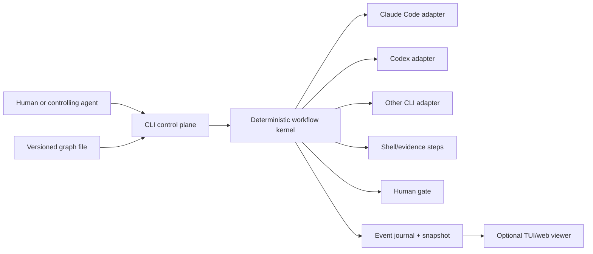
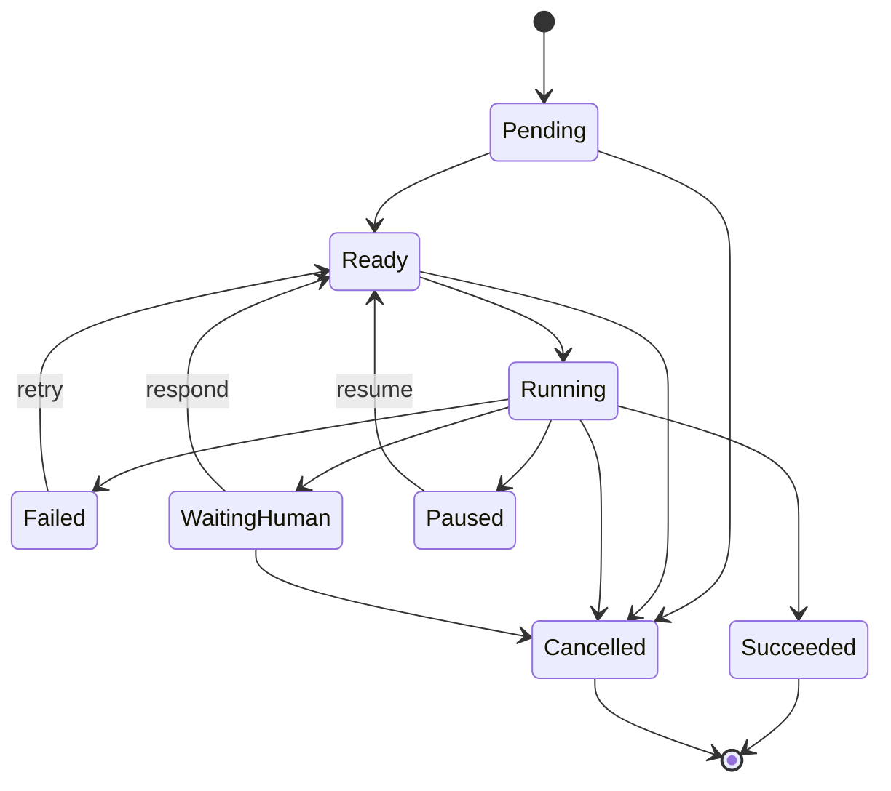

# Agentic Loop CLI: Landscape, Architecture, and Product Research

Research snapshot: **2026-07-19**  
Scope: open-source agent loops, graph/workflow orchestrators, human-control patterns, repository architecture, practitioner reports, blogs, Hacker News, Reddit, and GitHub issues/discussions.

## Executive conclusion

The loop itself is not the product. A loop can be one shell statement. The durable product opportunity is a **small, deterministic control plane around nondeterministic CLI agents**.

That control plane should own:

- the versioned graph and its legal transitions;
- external state, checkpoints, and crash recovery;
- subprocess lifecycle and backend capability differences;
- deterministic evidence gates such as tests, lint, builds, browser checks, and custom commands;
- budgets, retry limits, timeouts, and loop-breakers;
- observable, enforceable human intervention;
- an append-only account of what happened and why.

The agent should own the work inside a node. It should **not** be the sole authority on whether the run is complete, whether evidence is sufficient, or whether a protected transition may occur.

The most promising product position is not another agent framework, swarm, coding assistant, task tracker, or web dashboard. It is:

> **A local-first, agent-neutral workflow kernel that makes existing CLI agents programmable, interruptible, resumable, verifiable, and easy to operate from the same CLI by a human or another agent.**

The closest conceptual references are:

1. **Microsoft Conductor** for deterministic, source-controlled graph definitions and explicit context flow.
2. **Ralph TUI / Hats / Ralph implementations** for the practical outer-loop controls around coding CLIs.
3. **LangGraph** for checkpoint, interrupt, replay, and state semantics.
4. **Dagu** for a small local-first operational CLI: validate, dry-run, start, status, history, retry, approve.
5. **Gas Town / Beads** for persistent work identity, isolated workers, merge queues, and session handoff—while also showing what not to absorb into a thin orchestrator.

The clearest negative references are Ruflo's mismatch between its enormous claimed surface and disputed real execution paths, and Gas Town's rapid growth into a distributed agent operating system. Both reinforce the value of a small kernel with visible mechanics.

## 1. The problem space has four different loops

Many projects sound comparable because they all say “agents,” “loops,” or “orchestration,” but they operate at different levels.

| Layer | Typical cycle | What owns it | Examples |
|---|---|---|---|
| Inner agent loop | model → tool call → result → model | Coding-agent runtime | Claude Code, Codex, Aider, Goose, OpenHands |
| Outer/Ralph loop | start agent → inspect result/state → restart or stop | Loop harness | Hats, Ralph TUI, ralph-claude-code, Ralphy |
| Workflow graph | node → evidence/route → next node, possibly cyclic | Deterministic orchestrator | Microsoft Conductor, LangGraph, Mastra |
| Fleet/workspace loop | assign work → run isolated workers → integrate → replenish queue | Multi-agent control plane | Gas Town, parts of Ruflo |

The proposed CLI belongs primarily in layers two and three. It should treat layer-one agents as replaceable subprocess backends and resist becoming a layer-four agent operating system.

This boundary matters. If the CLI embeds its own LLM/tool runtime, memory product, task tracker, code-review system, remote worker platform, chat UI, and model router, it will stop being thin. The research shows that these surfaces grow independently and quickly dominate the actual orchestration code.

### A useful boundary



The kernel routes based on typed state and evidence. The agent may propose an outcome; the kernel validates and records it.

## 2. Popularity and fit snapshot

GitHub counts below were read through the GitHub API on 2026-07-19. Stars measure attention, not reliability or production adoption. “Open issues” is also not a quality score: project age, issue discipline, and community size differ substantially.

| Project | Stars / forks / open issues | Latest release or push | Primary role | Fit for this product |
|---|---:|---|---|---|
| [Ruflo](https://github.com/ruvnet/ruflo) | 65,155 / 7,735 / 533 | v3.32.8, 2026-07-18 | Very broad agent meta-harness/swarm platform | Feature catalog and warning about unverifiable breadth |
| [CrewAI](https://github.com/crewAIInc/crewAI) | 55,775 / 7,878 / 82 | pushed 2026-07-19 | Role-based multi-agent framework | Popular framework, but too agent/SDK-centric |
| [AutoGen](https://github.com/microsoft/autogen) | 59,815 / 9,003 / 562 | pushed 2026-04-15 | Programmable multi-agent framework | Conversation/team patterns; not a thin CLI reference |
| [LangGraph](https://github.com/langchain-ai/langgraph) | 37,611 / 6,307 / 400 | pushed 2026-07-19 | Durable state-graph runtime | Best mature semantics reference |
| [Mastra](https://github.com/mastra-ai/mastra) | 26,335 / 2,468 / 223 | pushed 2026-07-19 | TypeScript agent/workflow framework | Strong typed workflow and studio reference |
| [Gas Town](https://github.com/gastownhall/gastown) | 17,100 / 1,571 / 245 | v1.2.1, 2026-06-06 | Multi-agent workspace/factory manager | Strong persistence/isolation ideas; intentionally not thin |
| [Pydantic AI](https://github.com/pydantic/pydantic-ai) | 18,649 / 2,385 / 363 | pushed 2026-07-19 | Typed agent + graph library | Useful type-safe graph builder reference |
| [ralph-claude-code](https://github.com/frankbria/ralph-claude-code) | 9,551 / 729 / 24 | pushed 2026-07-18 | Hardened shell-based Ralph loop | Excellent catalogue of real outer-loop edge cases |
| [Dagu](https://github.com/dagucloud/dagu) | 3,647 / 292 / 56 | pushed 2026-07-19 | Local-first YAML workflow engine | Best non-AI operational CLI reference |
| [ralph-orchestrator / Hats](https://github.com/mikeyobrien/ralph-orchestrator) | 3,063 / 288 / 9 | v2.10.1, 2026-06-23 | Agent loop orchestrator | Direct competitor/reference |
| [Ralphy](https://github.com/michaelshimeles/ralphy) | 2,931 / 364 / 26 | pushed 2026-02-05 | Multi-backend coding-task loop | Good adapter/isolation reference; activity slowed |
| [Ralph TUI](https://github.com/subsy/ralph-tui) | 2,405 / 235 / 35 | v0.12.0, 2026-05-13 | Visible, controllable task loop | Best direct human-control UX reference |
| [Microsoft Conductor](https://github.com/microsoft/conductor) | 332 / 43 / 12 | v0.1.22, 2026-07-15 | Deterministic YAML multi-agent workflow CLI | Closest graph-oriented product thesis, still young |
| [Autoloop](https://github.com/mikeyobrien/autoloop) | 68 / 8 / 1 | v0.10.1, 2026-07-19 | Supervisor/worker loop experiment | Early but relevant alternate control model |

Agent runtimes such as [OpenHands](https://github.com/OpenHands/OpenHands), [Goose](https://github.com/aaif-goose/goose), and [Aider](https://github.com/Aider-AI/aider) are popular, but they are better treated as possible backends or architecture references than direct competitors. Building another inner agent loop would dilute the proposed product's advantage.

## 3. What the original Ralph idea actually contributes

Geoffrey Huntley's original July 2025 explanation is deliberately minimal: “Ralph is a technique” and, in its purest form, a Bash loop. The durable state is the repository plus a prompt, specifications, plan, tests, and commits. He emphasizes one bounded item per fresh loop, deterministic reallocation of the same external context, tests as backpressure, and continuous tuning based on observed failure. He also warns that multi-agent communication adds nondeterministic distributed-systems complexity and says the technique is best suited to greenfield work, not an existing production codebase. [Original Ralph article](https://ghuntley.com/ralph/).

That produces six durable ideas:

1. **Fresh attempts are a feature.** Throwing away conversational state reduces context rot when the durable working state is external.
2. **One bounded item per attempt.** Large prompts and oversized plans reduce reliability.
3. **The environment is the memory.** Specs, task state, commits, test results, and code carry information across sessions.
4. **Backpressure must come from reality.** Tests, compilers, linters, browser checks, and other oracles close the loop.
5. **Failure should tune the harness.** Repeated failure patterns become explicit rules or gates.
6. **The agent is not the system.** A simple outer control loop can replace or restart the agent without losing the project state.

The term “Ralph” now hides incompatible context policies. Some implementations continue the same session; others always start fresh; others compact or reset on thresholds. The new CLI should make this an explicit per-node policy:

- `fresh`: new backend session for every attempt;
- `continue`: resume the backend session;
- `compact`: save a structured handoff and start fresh;
- possibly `adaptive`: request compaction at a threshold, but never silently change semantics.

## 4. Architecture patterns that consistently work

### 4.1 Deterministic routing around nondeterministic work

[Microsoft Conductor](https://github.com/microsoft/conductor) makes the strongest explicit case: prompts and agent outputs may be nondeterministic, but workflow topology and route evaluation do not need an LLM. Its YAML routes use templates/expressions and first-match semantics, so the orchestration layer spends no tokens deciding what runs next. Its own launch post stresses explicit context flow, isolated agent sessions, and human oversight as a first-class step. [Microsoft's design explanation](https://opensource.microsoft.com/blog/2026/05/14/conductor-deterministic-orchestration-for-multi-agent-ai-workflows/).

This is the right default for the proposed CLI. An optional agent may generate or edit a graph, but a run should execute a validated immutable snapshot of that graph.

### 4.2 A graph, not only a DAG

General workflow tools often assume a DAG. Agentic implementation needs deliberate cycles:

- implement → test → implement;
- draft → review → revise;
- plan → human gate → re-plan;
- poll → wait → poll;
- task selection → execute → task selection.

Cycles must still be statically constrained. A useful validation rule is: **every strongly connected component must declare a bound or an exit contract**—attempt count, elapsed time, budget, evidence transition, or explicit human escalation. This prevents “graph” from becoming an attractive spelling of `while true`.

### 4.3 External, typed state

The strongest systems keep control-relevant facts out of model prose:

- current node and attempt;
- completed node outputs;
- selected route and reason;
- pending human decisions;
- costs, tokens, and elapsed time;
- backend session identifiers;
- evidence results;
- artifacts and changed files;
- run terminal state.

[LangGraph persistence](https://docs.langchain.com/oss/python/langgraph/persistence) saves checkpoints at graph steps and supports history, replay, edited state, pending writes, and recovery. [Mastra snapshots](https://mastra.ai/en/reference/workflows/snapshots) capture step state, outputs, path, suspended steps, retries, and resume context. Conductor uses atomic JSON checkpoint files, a workflow hash, secure file permissions, backend session IDs, an event-log path, and a stable run ID in [`checkpoint.py`](https://github.com/microsoft/conductor/blob/main/src/conductor/engine/checkpoint.py).

For a local-first MVP, an append-only JSONL journal plus an atomically replaced compact snapshot is a strong balance:

- journal: audit, replay, debugging, streaming;
- snapshot: fast status and resume;
- graph snapshot/hash: definition integrity;
- artifact directory: large or binary data stays out of state JSON.

SQLite can come later if querying many runs becomes important. Starting with a database is unnecessary; pretending a mutable JSON file is a concurrent database is unsafe.

### 4.4 Human control as protocol, not prompt text

There are three different forms of intervention:

| Kind | Semantics | Enforcement |
|---|---|---|
| Advisory guidance | Include this on the next attempt | Agent may ignore; event records delivery |
| Must-acknowledge instruction | Agent must explicitly address it before progressing | Route is blocked until an acknowledgement event is accepted |
| Blocking decision | Approve, edit, reject, choose, or cancel | Kernel owns the wait state and route |

This distinction is necessary. Ralph issue [#217](https://github.com/mikeyobrien/ralph-orchestrator/issues/217) describes multiple live guidance messages that were visible but ignored while review still passed and work was committed. Issue [#193](https://github.com/mikeyobrien/ralph-orchestrator/issues/193) reports role and approval constraints being bypassed because they existed only in instructions.

[LangGraph interrupts](https://docs.langchain.com/oss/python/langgraph/interrupts) correctly treat a human interaction as durable suspension with a serializable payload and explicit resume value. [Dagu approvals](https://docs.dagu.sh/writing-workflows/approval) similarly make approval an operational step. Conductor's human gates and Esc/Ctrl+G interruption are separate mechanisms, which is also the right distinction: planned decision nodes are not the same as an operator pausing a running process.

### 4.5 Evidence gates, not self-reported completion

An agent-generated `COMPLETE`, `EXIT_SIGNAL`, or structured status is useful, but it is a proposal. Real projects show all failure directions: premature completion, missed completion, immediate completion, and useful work killed by a stale-loop heuristic. Examples include Ralph issues [#123](https://github.com/mikeyobrien/ralph-orchestrator/issues/123), [#47](https://github.com/mikeyobrien/ralph-orchestrator/issues/47), [#60](https://github.com/mikeyobrien/ralph-orchestrator/issues/60), [#66](https://github.com/mikeyobrien/ralph-orchestrator/issues/66), and [#234](https://github.com/mikeyobrien/ralph-orchestrator/issues/234).

The runtime should combine:

- typed agent proposal;
- required deterministic gates;
- task-state invariants;
- protected-transition approval;
- attempt and budget limits.

A gate should return one of three outcomes:

- `pass`: transition is eligible;
- `fail`: evidence is fed back to a retry/fix route;
- `escalate`: human decision is required.

### 4.6 Parallelism only with explicit isolation and fan-in

Parallel agents increase throughput only when work is separable. Worktrees prevent filesystem collision, not conflicting design decisions. Practitioner reports repeatedly place the useful human-review ceiling around a few workers and say mature codebases make decomposition harder. [Ask HN discussion](https://news.ycombinator.com/item?id=46993479).

The proposed CLI should default to sequential execution and require a concurrency group to declare:

- independence/declared dependencies;
- workspace policy: shared read-only, worktree, container, or external directory;
- maximum concurrency;
- write ownership or protected paths;
- failure mode: fail-fast, continue, or all-or-nothing;
- fan-in aggregation;
- integration/merge policy and evidence gate.

Do not make “spawn a swarm” the primary abstraction. Make `map`, `parallel`, and `join` ordinary, visible graph constructs.

### 4.7 The event stream is the product API

Conductor's small [`events.py`](https://github.com/microsoft/conductor/blob/main/src/conductor/events.py) decouples execution from console and web rendering. Ralph tools increasingly add JSONL metrics and structured output after discovering how brittle text parsing is. Dagu exposes run IDs, status, history, and retry operations.

The strongest design is one canonical event stream consumed by:

- human terminal rendering;
- `--json` / JSONL agent output;
- an optional TUI;
- logs and replay;
- remote or background control later.

Do not make the TUI the control API. Both a person and an agent should be able to call stable verbs and receive stable data.

## 5. Deep dive: Ralph Orchestrator / Hats

Repository: [mikeyobrien/ralph-orchestrator](https://github.com/mikeyobrien/ralph-orchestrator)  
Source revision inspected: [`01dd250`](https://github.com/mikeyobrien/ralph-orchestrator/tree/01dd250ae3842164ee11dad00db5a2c1239abd12)  
Current public product site: [Hats](https://www.hats.sh/), “formerly ralph-orchestrator”

### Purpose and philosophy

Ralph is a Rust orchestration platform that repeatedly starts AI backends with reconstructed context and coordinates work through structured events. Its [tenets](https://github.com/mikeyobrien/ralph-orchestrator/blob/01dd250ae3842164ee11dad00db5a2c1239abd12/docs/concepts/tenets.md) emphasize fresh context, disk/Git as durable memory, backpressure over rigid plans, disposable plans, evidence, and acknowledged human guidance.

It began as a loop orchestrator but is now a broad product: multiple backends, TUI, web/API, Telegram control, MCP, worktrees, parallel loops, agent waves, tasks, memory, cost accounting, and remote operation. The Hats site adds role/persona presets, backpressure gates, budgets, checkpoints, and mobile guidance. This is an excellent catalogue of eventual user demands, but no longer a model of a thin implementation.

### Actual execution flow

```text
ralph run
  → resolve objective, loop ID, workspace/worktree, and resume state
  → initialize hats, event bus/journal, tasks, memories, and guards
  → derive active hat(s) from pending JSONL events
  → inject active role instructions into the single Ralph coordinator
  → build a fresh prompt from objective + task/memory/guidance/events
  → select backend/model from the active role
  → run backend via PTY/ACP/CLI
  → backend edits workspace and publishes `ralph emit` events
  → validate authorization, evidence, and completion prerequisites
  → route the accepted event, or synthesize a default event
  → repeat until success, cancellation, budget, runtime, or stall guard
```

The core mechanics are in [`event_loop/mod.rs`](https://github.com/mikeyobrien/ralph-orchestrator/blob/01dd250ae3842164ee11dad00db5a2c1239abd12/crates/ralph-core/src/event_loop/mod.rs): termination checks, completion checks, active-role derivation, prompt building, default publishing, output processing, and journal processing. Durable counters and activation/guidance/stall state live in [`loop_state.rs`](https://github.com/mikeyobrien/ralph-orchestrator/blob/01dd250ae3842164ee11dad00db5a2c1239abd12/crates/ralph-core/src/event_loop/loop_state.rs). Backend lifecycle, UI/RPC streams, hooks, waves, costs, recovery, and completion are coordinated in [`loop_runner.rs`](https://github.com/mikeyobrien/ralph-orchestrator/blob/01dd250ae3842164ee11dad00db5a2c1239abd12/crates/ralph-cli/src/loop_runner.rs).

A subtle but important finding: hats primarily define topology, contracts, prompts, and backend overrides. Iterations still run through one constant Ralph coordinator; hats are not independent orchestrator processes. Naming roles as processes would obscure the real execution model.

### State, routing, and completion

Canonical run events are timestamped `.ralph/events-*.jsonl` files, with a pointer to the active journal. Other state includes task JSONL, memories/scratchpads, saved loop state, loop registry, merge queue, locks, and stop requests.

Completion is multi-gated:

1. the configured completion event is emitted;
2. required events already exist;
3. guidance has been acknowledged;
4. blocking runtime tasks are closed;
5. persistent-mode rules permit stopping;
6. evidence and event validation accept the claim.

Termination guards cover iterations, elapsed time, cost, repeated failure, redispatch thrashing, malformed events, repeated/stale signatures, and operator stop. This area contains direct lessons from earlier issue reports, not merely speculative feature design.

Hats declare subscribed triggers, publishable events, instructions, per-role backend/model choices, concurrency, and aggregation behavior. Agent waves provide scatter/gather parallelism with isolated event files; parallel top-level loops use Git worktrees, branches, a registry, and a merge queue. [Agent waves](https://github.com/mikeyobrien/ralph-orchestrator/blob/01dd250ae3842164ee11dad00db5a2c1239abd12/docs/advanced/agent-waves.md), [parallel loops](https://github.com/mikeyobrien/ralph-orchestrator/blob/01dd250ae3842164ee11dad00db5a2c1239abd12/docs/advanced/parallel-loops.md).

### Human and backend control

The CLI exposes run/plan/code-task/init/doctor/preflight/events/emit/wave/loops/hats plus TUI, web, MCP, and bot surfaces. Human interaction includes a blocking interaction node, asynchronous guidance, required acknowledgement, status/tasks/restart/cancel, a full-screen TUI, RPC/headless modes, web, and Telegram. Backend adapters cover Claude, Codex, Gemini, Kiro, Copilot, OpenCode, Pi, Forge, and Amp.

This is exactly why the canonical control protocol should be smaller than any UI. Ralph's multiple surfaces are useful; they should all be projections/adapters over the same run journal and control operations.

### Repository structure and assessment

The Rust workspace contains nine crates: CLI, core, adapters, protocol, TUI, Telegram, API, end-to-end tests, and benchmarks, plus a TypeScript web application. There are roughly 1,095 tracked files. Despite the crate split, `loop_runner.rs` is roughly 13,400 lines and concentrates too many responsibilities.

Steal:

- fresh-context reconstruction;
- event authorization and required-event completion;
- guidance acknowledgement;
- operational termination/stall guards;
- broad subprocess backend experience;
- process cleanup, worktree locks, registry, and merge queue lessons;
- parallel work as an explicit wave/isolated-loop construct.

Avoid:

- the monolithic runner;
- terminology that implies separate actors when one coordinator executes them;
- bundling TUI, web, bots, task/memory products, and remote operations into the kernel;
- stale documentation and migration semantics becoming part of the core model.

The most telling roadmap signal is that Ralph plans to use Autoloop as its future engine and remain the richer coordination/UI layer. See Autoloop [#29](https://github.com/mikeyobrien/autoloop/issues/29) and Ralph [#342–#347](https://github.com/mikeyobrien/ralph-orchestrator/issues/342).

## 6. Deep dive: Autoloop

Repository: [mikeyobrien/autoloop](https://github.com/mikeyobrien/autoloop)  
Source revision inspected: [`ae67c27`](https://github.com/mikeyobrien/autoloop/tree/ae67c272007dbe204807f16314051db8e604ceb2)

### Why it is the closest reference

Autoloop is a Ralph spinoff explicitly attempting to retain useful loop mechanics while reducing experimental surface. It is preset-driven and designed to be inspectable by both a human and an agent. Its core architectural rule is particularly strong: **the append-only journal is canonical; registries, dashboards, inspection output, and summaries are derived projections**. [Platform concepts](https://github.com/mikeyobrien/autoloop/blob/ae67c272007dbe204807f16314051db8e604ceb2/docs/concepts/platform.md), [topology reference](https://github.com/mikeyobrien/autoloop/blob/ae67c272007dbe204807f16314051db8e604ceb2/docs/reference/topology.md).

Autoloop is the better implementation reference for the proposed thin kernel. Its low adoption and pre-1.0 maturity mean it is evidence of a good direction, not validation of production reliability.

### Actual execution flow

```text
autoloop run
  → load preset/config and validate topology
  → choose isolation and initialize run directory
  → quarantine corrupted journal entries
  → install run-scoped emit/control tools
  → append run start and acceptance contract
  → driveLoop
      → drain durable operator requests
      → check review/stall/cost/runtime/premature-quit guards
      → reload next-iteration configuration
      → derive route/active role from this run's journal
      → construct fresh prompt
      → start backend with bounded timeout
      → journal output, usage, cost, and file changes
      → run hooks and validate emitted event/evidence
      → execute requested fanout/stage/concurrency work
      → treat completion claim as provisional
      → run deterministic acceptance postconditions
      → complete, hold, or iterate
  → update run/worktree state and optionally merge/clean
  → run teardown hooks and emit final SDK event
```

[`packages/harness/src/index.ts`](https://github.com/mikeyobrien/autoloop/blob/ae67c272007dbe204807f16314051db8e604ceb2/packages/harness/src/index.ts) contains the run/drive loop, controls, guards, teardown, and worktree lifecycle. [`iteration.ts`](https://github.com/mikeyobrien/autoloop/blob/ae67c272007dbe204807f16314051db8e604ceb2/packages/harness/src/iteration.ts) runs an attempt and resolves its outcome. [`prompt.ts`](https://github.com/mikeyobrien/autoloop/blob/ae67c272007dbe204807f16314051db8e604ceb2/packages/harness/src/prompt.ts) reconstructs context from durable state. [`emit.ts`](https://github.com/mikeyobrien/autoloop/blob/ae67c272007dbe204807f16314051db8e604ceb2/packages/harness/src/emit.ts) enforces event, evidence, and task gates. [`journal.ts`](https://github.com/mikeyobrien/autoloop/blob/ae67c272007dbe204807f16314051db8e604ceb2/packages/core/src/journal.ts) implements versioned, timestamped, fsynced JSONL; [`registry/derive.ts`](https://github.com/mikeyobrien/autoloop/blob/ae67c272007dbe204807f16314051db8e604ceb2/packages/core/src/registry/derive.ts) rebuilds projections.

### Topology is partly advisory

Autoloop topology contains roles, role prompts, emitted events, handoffs, gates, fanout stages, reducers/quorum, concurrency, and per-role backend/model/tool policy. [`topology.ts`](https://github.com/mikeyobrien/autoloop/blob/ae67c272007dbe204807f16314051db8e604ceb2/packages/core/src/topology.ts) checks unreachable/orphan roles, missing events, unreachable completion, dead gates, unroutable failures, malformed stages, bad triggers/result routing, invalid thresholds, and invalid concurrency.

It is not purely a deterministic graph interpreter. A handoff suggests which role becomes active, while a model still chooses the next event; the hard boundary is the allowed-event set.

The proposed product can make this distinction explicit with two selectors:

- `scheduler`: runtime evaluates ordered edge conditions and chooses the next node;
- `agent`: agent proposes an allowed event/route, which the runtime validates.

This permits exploratory loops without weakening known workflows.

### Human/agent symmetry

Autoloop's operator interface is the strongest direct answer to the user's “easy to control by human and agent” requirement:

- structured JSON responses and NDJSON live events;
- documented exit codes and stdout/stderr separation;
- machine-readable `capabilities` contract;
- `robot-docs`;
- `triage`, returning health, diagnostics, statistics, and recommended next commands;
- `inspect`, `watch`, `control guide`, `control interrupt`, `control respond`;
- durable control request before process signalling;
- blocking human questions and optional live steering;
- a narrow SDK with cancellation and event callback.

See [`main.ts`](https://github.com/mikeyobrien/autoloop/blob/ae67c272007dbe204807f16314051db8e604ceb2/packages/cli/src/main.ts), [`capabilities.ts`](https://github.com/mikeyobrien/autoloop/blob/ae67c272007dbe204807f16314051db8e604ceb2/packages/cli/src/commands/capabilities.ts), [`triage.ts`](https://github.com/mikeyobrien/autoloop/blob/ae67c272007dbe204807f16314051db8e604ceb2/packages/cli/src/commands/triage.ts), and [`control.ts`](https://github.com/mikeyobrien/autoloop/blob/ae67c272007dbe204807f16314051db8e604ceb2/packages/cli/src/commands/control.ts).

### Parallelism, repository structure, and maturity

Autoloop supports agent-triggered waves, declarative concurrency, first-class fanout stages, structured branch output, reducers/quorum, isolated wave state, chained presets, and an architect mode that generates and validates a workflow. The npm workspace already has ten packages: core, presets, backends, harness, dashboard, Kanban, CLI, issue-sync core, GitHub sync, and Linear sync—roughly 809 tracked files.

This cleaner separation is preferable to Ralph's monolithic runner, but the scope is already broader than the proposed MVP. It is also young: 68 stars, eight forks, less than four months of public history, and a highly concentrated maintainer base. The v0.10.0 hardening release fixed serious issues including routing broken by hooks, silent event-emission breakage, unknown backends falling back to Claude, invalid CLI usage exiting successfully, crashes leaving active run state, lost provisional completion, and hanging ACP handshakes. [Changelog](https://github.com/mikeyobrien/autoloop/blob/ae67c272007dbe204807f16314051db8e604ceb2/CHANGELOG.md).

A source consistency check also found a likely worktree lifecycle defect: the harness considers only `stopReason === "completed"` successful for automerge, while normal accepted completions appear to return `completion_event` or `completion_promise`; the unit test mocks the older `completed` value. This should be verified against the released binary, but it usefully demonstrates why terminal outcomes should be one enum shared across engine, worktree policy, CLI, and tests.

Steal:

- versioned append-only canonical journal;
- rebuildable projections;
- one-file declarative topology with static validation;
- provisional completion plus deterministic acceptance;
- durable shared human/agent controls;
- JSON/NDJSON, stable exit codes, capabilities discovery, and one-call triage;
- explicit budgets and isolation modes;
- clean separation between core, harness, backend, and CLI.

Avoid initially:

- dashboard/Kanban and issue trackers in the engine repository;
- dynamic architect/preset ecosystems before the base graph is stable;
- unsafe permission defaults;
- silent backend fallback of any kind;
- multiple terminal-status spellings across layers.

## 7. Deep dive: Ruflo

Repository: [ruvnet/ruflo](https://github.com/ruvnet/ruflo)  
Source revision inspected: `12ede21767a6dd669df1b79392a5d27d9154f237`

### What it is

Ruflo, formerly Claude Flow, describes itself as an agent “meta-harness”: a very broad layer of CLI commands, MCP tools, agents, skills, memory, policies, workflows, swarms, hooks, sandboxes, and provider integrations. The most precise statement is in its own [`AGENTS.md`](https://github.com/ruvnet/ruflo/blob/main/AGENTS.md): the Ruflo/Claude Flow side is the **ledger**, while Codex or Claude is the **executor**.

That distinction is essential because many commands with execution-sounding names record coordination state rather than launch a worker.

### Actual CLI and execution flow

The root [`bin/cli.js`](https://github.com/ruvnet/ruflo/blob/main/bin/cli.js) proxies into the v3 CLI. The v3 [`bin/cli.js`](https://github.com/ruvnet/ruflo/blob/main/v3/@claude-flow/cli/bin/cli.js) selects stdio MCP mode when piped; otherwise it creates the interactive CLI. [`CLI.run`](https://github.com/ruvnet/ruflo/blob/main/v3/@claude-flow/cli/src/index.ts) lazily loads commands, parses/adopts configuration, refreshes helpers, may autostart a daemon, and invokes the selected command. [`commands/index.ts`](https://github.com/ruvnet/ruflo/blob/main/v3/@claude-flow/cli/src/commands/index.ts) is the lazy registry, while [`mcp-client.ts`](https://github.com/ruvnet/ruflo/blob/main/v3/@claude-flow/cli/src/mcp-client.ts) provides an in-process MCP-first API.

This **CLI → stable MCP handler** split is one of Ruflo's strongest reusable ideas. The same semantics can serve human commands and agent tool calls.

The swarm path is more modest than its vocabulary suggests:

1. [`swarm.ts`](https://github.com/ruvnet/ruflo/blob/main/v3/@claude-flow/cli/src/commands/swarm.ts) accepts topology names such as hierarchical, mesh, ring, star, and hybrid.
2. [`swarm_init`](https://github.com/ruvnet/ruflo/blob/main/v3/@claude-flow/cli/src/mcp-tools/swarm-tools.ts) writes coordination metadata into `.claude-flow/swarm/swarm-state.json`.
3. `swarm start` also writes `.swarm/state.json`.
4. The command itself explains that execution happens through Claude's Agent tool, `claude -p`, or another executor.

Likewise, [`agent_spawn`](https://github.com/ruvnet/ruflo/blob/main/v3/@claude-flow/cli/src/mcp-tools/agent-tools.ts) records an agent in `.claude-flow/agents/store.json`; it does not start a subprocess. A newer real `agent_execute` path calls [`executeAgentTask`](https://github.com/ruvnet/ruflo/blob/main/v3/@claude-flow/cli/src/mcp-tools/agent-execute-core.ts) to make an Anthropic/OpenRouter/Ollama API request. That is real execution, but it is a one-shot model call, not a terminal coding-agent tool loop.

### Workflow semantics

[`workflow-tools.ts`](https://github.com/ruvnet/ruflo/blob/main/v3/@claude-flow/cli/src/mcp-tools/workflow-tools.ts) contains both a mostly declarative `workflow_run` path and an actual sequential `workflow_execute` interpreter.

Implemented node behavior:

- `task`: one-shot `executeAgentTask`;
- `wait`: sleep, capped at 60 seconds;
- `condition`: simple equality and numeric step jumps;
- pause/cancel checks between steps;
- state save before and after steps.

The `parallel` and `loop` node types are explicitly skipped as not yet implemented. There is no general DAG/cyclic-graph scheduler or dependency-driven readiness queue in this path.

The source also shows contract drift at seams: [`commands/task.ts`](https://github.com/ruvnet/ruflo/blob/main/v3/@claude-flow/cli/src/commands/task.ts) accepts dependencies and sends `assignedTo`, while [`task-tools.ts`](https://github.com/ruvnet/ruflo/blob/main/v3/@claude-flow/cli/src/mcp-tools/task-tools.ts) expects `assignTo` and does not persist dependencies. This is the kind of drift that schema-generated CLI/MCP bindings should prevent.

### State and memory

Ruflo uses several overlapping roots:

- `.swarm/memory.db` for memory;
- `.swarm/state.json` for CLI swarm state;
- `.claude-flow/swarm/swarm-state.json` for MCP swarm state;
- separate JSON stores for agents, tasks, and workflows.

Its memory subsystem is substantive: [`memory-tools.ts`](https://github.com/ruvnet/ruflo/blob/main/v3/@claude-flow/cli/src/mcp-tools/memory-tools.ts) treats the SQLite database as canonical and the [memory package](https://github.com/ruvnet/ruflo/blob/main/v3/@claude-flow/memory/README.md) combines SQL.js, HNSW snapshots, full-text fallback, fusion/reranking, and consolidation.

But this also illustrates why memory should be optional in the proposed orchestrator. Multiple roots make status derivation and recovery difficult. Ruflo issue [#2633](https://github.com/ruvnet/ruflo/issues/2633) reports working-directory-keyed state, daemon multiplication, and concurrent memory-write durability problems. Issue [#2726](https://github.com/ruvnet/ruflo/issues/2726) reports the full MCP schema overwhelming smaller-context models.

### Human control and extensibility

[`autopilot.ts`](https://github.com/ruvnet/ruflo/blob/main/v3/@claude-flow/cli/src/commands/autopilot.ts) is directly relevant: it implements a bounded stop-hook loop with maximum iterations, timeout, stall detection, checkpoints, rollback, and automatic disablement. Ruflo also offers status/stop commands, interactive confirmation, JSON-facing MCP operations, a guidance package with policy/budget concepts, and a large plugin system under [`v3/@claude-flow/plugins`](https://github.com/ruvnet/ruflo/blob/main/v3/@claude-flow/plugins/README.md).

Initialization is correspondingly broad. [`executeInit`](https://github.com/ruvnet/ruflo/blob/main/v3/@claude-flow/cli/src/init/executor.ts) creates `.claude`, `.claude-flow`, settings, MCP configuration, helpers, agents, workflows, and memory. Automatic helper refresh and daemon startup are surprising mutations for a thin control layer.

### Assessment

Steal:

- one stable machine API behind both CLI and MCP;
- explicit bounded-loop, timeout, stall, checkpoint, and rollback controls;
- provider/plugin capability discovery;
- honest distinctions between ledger operations and actual execution.

Avoid:

- using “spawn,” “swarm,” or “topology” for metadata-only operations;
- advertising node kinds before the scheduler executes them;
- multiple canonical state roots;
- always-on daemons and broad workspace mutation in the core;
- an MCP/tool catalog so large that it becomes context overhead;
- release velocity that outruns cross-layer contract tests.

An independent source audit argued that earlier Ruflo versions were mostly state stubs rather than subprocess orchestration. The current source has since added real one-shot API execution and a sequential workflow interpreter, so that audit is partly outdated; its criticism still applies to `agent_spawn`, topology records, and unimplemented graph nodes. [Reddit audit](https://www.reddit.com/r/ClaudeAI/comments/1sckiy8/do_not_install_ruflo_into_your_claude_code/), [full audit](https://gist.github.com/roman-rr/ed603b676af019b8740423d2bb8e4bf6).

## 8. Deep dive: Gas Town

Repository: [gastownhall/gastown](https://github.com/gastownhall/gastown)  
Source revision inspected: `5ffa55a2bc03fa1110ea0b1495bfa26bbe6b66f3`

### What it is

Gas Town is a real multi-agent workspace and process manager. It launches terminal agents, creates isolated worktrees, keeps durable work independent of sessions, supervises workers, and manages integration. Its vocabulary is memorable but costly:

- Town: control-plane workspace;
- Rig: managed repository;
- Bead: durable issue/work item;
- Hook: work assigned to an agent identity;
- Formula/molecule/wisp: workflow template/instance forms;
- Polecat: ephemeral worker in a worktree;
- Crew: long-lived human-facing clone;
- Mayor: main human interface;
- Witness/Deacon/Dogs: monitoring and maintenance roles;
- Refinery: merge queue;
- Convoy: related work group.

The creator explicitly compares it to Kubernetes and Temporal and also warns that it is complicated, expensive, hands-on, and unsafe for inexperienced operators. [Welcome to Gas Town](https://steve-yegge.medium.com/welcome-to-gas-town-4f25ee16dd04).

### Actual dispatch and completion flow

1. [`cmd/gt/main.go`](https://github.com/gastownhall/gastown/blob/main/cmd/gt/main.go) enters the Cobra application in [`internal/cmd/root.go`](https://github.com/gastownhall/gastown/blob/main/internal/cmd/root.go).
2. [`runSling`](https://github.com/gastownhall/gastown/blob/main/internal/cmd/sling.go) handles target, formula, batch, convoy, merge policy, scheduler, and Ralph options.
3. [`resolveTarget`](https://github.com/gastownhall/gastown/blob/main/internal/cmd/sling_target.go) resolves self, dogs, rigs requiring a new worker, existing agents, or replacement workers.
4. [`executeSling`](https://github.com/gastownhall/gastown/blob/main/internal/cmd/sling_dispatch.go) performs a durable dispatch transaction: validate assignment, create a worker/worktree, optionally create a convoy, instantiate a formula, hook the bead, create Dolt state/checkpoints, start the terminal session, and roll back artifacts on failure.
5. [`runDone`](https://github.com/gastownhall/gastown/blob/main/internal/cmd/done.go) validates completion/escalation/deferral, recovers worktree state, safety-commits uncommitted work, pushes or submits the merge handoff, and retires the worker only after durable transfer.

Unlike Ruflo's swarm registry, this is an actual process/worktree lifecycle.

### Workflow model

[`docs/concepts/molecules.md`](https://github.com/gastownhall/gastown/blob/main/docs/concepts/molecules.md) describes formulas as TOML templates, cooked into materialized or lightweight instances. Dependency arrays and the Beads graph encode readiness. Expensive workflows may “pour” substeps into durable rows for checkpoint recovery; the default lightweight form avoids producing thousands of database records.

The important caveat is that default formulas are not executed by one deterministic graph interpreter. `gt prime` renders a checklist into an agent's context, and the agent carries out many steps. Workflow semantics are split across formulas, Beads, role prompts, and Go commands. This is flexible and token-expensive; it also weakens static guarantees.

### Persistence and isolation

The current [`architecture.md`](https://github.com/gastownhall/gastown/blob/main/docs/design/architecture.md) describes:

- one Dolt SQL server per town;
- a town database for coordination/identities;
- per-rig databases for work and merge requests;
- routed issue prefixes;
- redirect pointers from worktrees to canonical state;
- Git worktrees for ephemeral workers and integration;
- full clones for long-lived crew;
- a work lifecycle that can decay, compact, and flatten history.

This is Gas Town's strongest contribution: **durable work and identity are separate from disposable agent sessions**, and structured coordination is separate from code workspaces.

### Human control

Gas Town has the richest control surface studied:

- `gt sling` for target, formula, merge mode, deferral, and batch;
- `gt feed --problems` for stalled, zombie, idle, and working states;
- dashboard and command palette;
- nudge, mail, handoff, escalation, and predecessor-session consultation;
- scheduler pause/resume;
- emergency stop/thaw;
- a no-tmux mode retaining work tracking while the human starts agents.

Open issues reveal why every operation must verify persistence before reporting success. [#4527](https://github.com/gastownhall/gastown/issues/4527) describes `gt sling` reporting success while the agent sees no work; [#4516](https://github.com/gastownhall/gastown/issues/4516) reports a dog dispatch without a durable hook; [#4512](https://github.com/gastownhall/gastown/issues/4512) reports local-only intent lost during redispatch, leading to a remote push.

### Provider boundary and repository shape

Gas Town does not import agent SDKs. Its [provider integration guide](https://github.com/gastownhall/gastown/blob/main/docs/agent-provider-integration.md) defines tiers from generic terminal/send-keys support through presets, lifecycle hooks, and richer resume/fork integrations. This loose coupling is a better match for the proposed tool than embedding every vendor SDK.

Decision-relevant directories:

- `internal/cmd/`: large command/orchestration layer;
- `internal/beads/`: durable work ledger;
- `internal/formula/`: workflow definitions;
- `internal/polecat/`: worker/worktree lifecycle;
- `internal/refinery/`: merge queue;
- `internal/convoy/`: grouped/dependent work;
- `internal/hooks/`: provider lifecycle integration;
- `internal/witness/`, `internal/deacon/`, `internal/scheduler/`: monitoring loops;
- `internal/runtime/`, `internal/session/`, `internal/tmux/`: process abstraction;
- `internal/feed/`, `internal/web/`: observability;
- `templates/agents/`: role prompts.

The layout is conceptually modular, but `internal/cmd` is a sprawling coordination hotspot. That is a warning to keep domain operations out of CLI command handlers.

### Assessment

Steal:

- durable task/identity ledger separate from sessions;
- real process lifecycle and rollback;
- optional worktree isolation;
- completion only after durable handoff;
- first-class inspect, nudge, pause, escalate, and emergency controls;
- provider-neutral terminal adapters;
- explicit integration/merge queue.

Avoid in the core:

- the full workspace/fleet operating system;
- lore-heavy vocabulary;
- mandatory Dolt/tmux/daemon stack;
- LLM-interpreted workflow steps where deterministic execution is possible;
- routing/recovery spread between prompts, commands, formulas, and database rules;
- optimistic success before verifying the durable record.

A candid launch-period DoltHub trial found autonomous merges despite failing tests, inaccurate status from the Mayor, four unusable PRs, and roughly $100 spent in an hour; it still praised the Mayor as an interface. The project has changed substantially since that January report, but the failure class remains relevant. [A Day in Gas Town](https://www.dolthub.com/blog/2026-01-15-a-day-in-gas-town/).

## 9. Closest adjacent architecture: Microsoft Conductor

Conductor is the closest graph-product comparison even though it is young and already much larger than a thin kernel.

### Definition and runtime

The workflow is a YAML file containing workflow metadata, typed inputs/outputs, agent or non-agent steps, and ordered routes. The core package is sensibly separated:

- `config/`: Pydantic schema, loader, cross-reference validation;
- `engine/`: workflow, context, routing, limits, checkpoint, usage;
- `executor/`: agent, shell, set, wait, templates, output;
- `providers/`: SDK adapters and declared capability contracts;
- `gates/` and `interrupt/`: planned human nodes versus operator pause;
- `events.py`: pub/sub boundary;
- `web/`: FastAPI/WebSocket server and React graph dashboard.

[`WorkflowEngine.run`](https://github.com/microsoft/conductor/blob/main/src/conductor/engine/workflow.py) initializes context and limits, then enters `_execute_loop`. The loop checkpoints at step boundaries, resolves a regular node/parallel group/for-each group, enforces limits, constructs context, executes the step, stores output, evaluates first-match routes, emits events, and either continues or builds terminal output. [`router.py`](https://github.com/microsoft/conductor/blob/main/src/conductor/engine/router.py) keeps route selection separate. [`AgentExecutor`](https://github.com/microsoft/conductor/blob/main/src/conductor/executor/agent.py) renders prompts and per-agent configuration, resolves tools, calls a provider, normalizes output, and validates the schema.

### Context and durability

[`context.py`](https://github.com/microsoft/conductor/blob/main/src/conductor/engine/context.py) supports three explicit flow policies:

- accumulate all prior outputs;
- last output only;
- explicit named dependencies.

This is a valuable model, although the proposed CLI should distinguish orchestration data dependencies from LLM context policy rather than treating them as the same setting.

Checkpoints are atomic JSON files with a graph hash, current step, serialized context and limits, backend session IDs, system metadata, instructions, run ID, and event log. Periodic checkpoints occur at a single step-boundary choke point; completion removes stale periodic checkpoints while unexpected failure leaves recovery data intact. These details are unusually careful for a young project.

### Human control and observability

Conductor has explicit human-gate nodes, dialog mode, Esc/Ctrl+G interruption, maximum-iteration extension prompts, web stop/kill endpoints, live streaming, and replay. Planned gates and emergency/process interruption are correctly separate.

The web dashboard is event-driven and can visualize the graph, stream node details, accept gates, and replay prior events. This is valuable, but it also demonstrates scope growth: at the inspected revision, `engine/workflow.py` was about 6,021 lines, `config/schema.py` 2,317, and `cli/run.py` 2,477. The kernel, config model, CLI lifecycle, and UI have accumulated significant complexity.

### Assessment

Steal the deterministic definition, validation, explicit context, step taxonomy, events, checkpoint discipline, provider capability contracts, and separation of gates from interruption.

Keep the new product thinner by:

- invoking external agent CLIs before embedding provider SDKs;
- keeping the first node taxonomy very small;
- splitting the scheduler/state machine before it becomes one multi-thousand-line engine;
- treating web UI, registries, model pricing, and MCP management as later adapters;
- ensuring `run` and `resume` share one state-machine path from the beginning.

## 10. Other adjacent references

### Dagu: operational CLI and local-first packaging

[Dagu](https://github.com/dagucloud/dagu) is not primarily an agent project, which makes it a useful control experiment. It offers a single binary, YAML definitions, file-backed state, optional web UI, retries, queues, logs, artifacts, approvals, and distributed workers only when needed. Its CLI verbs—`dry`, `validate`, `start`, `stop`, `restart`, `status`, `history`, `retry`, `enqueue`, and cleanup—are close to the operational surface the proposed product needs. [Dagu overview](https://docs.dagu.sh/overview/).

The best lesson is progressive complexity: standalone, headless, or coordinator/worker modes use the same workflow model. The limitation for this product is that a conventional DAG cannot directly express iterative evaluator/fixer cycles; the new tool needs bounded cyclic graphs.

### LangGraph: the mature state semantics reference

[LangGraph](https://github.com/langchain-ai/langgraph) is a library/runtime rather than a simple CLI. Its strongest ideas are checkpointed threads, state history, replay/fork, pending writes, and durable interrupts. A thread ID acts as a persistent cursor. A dynamic interrupt serializes a payload and resumes with an explicit value. [Persistence](https://docs.langchain.com/oss/python/langgraph/persistence), [interrupts](https://docs.langchain.com/oss/python/langgraph/interrupts).

Its complexity is also instructive: resuming restarts the interrupted node, so side effects before the interrupt must be idempotent. Users report confusion around resume points and state updates. The new tool should pause primarily at **node/attempt boundaries**, use explicit idempotency keys for external effects, and make replay versus resume different verbs.

### Mastra: typed TypeScript workflows and snapshots

[Mastra](https://github.com/mastra-ai/mastra) provides typed sequential, parallel, branch, loop, suspend/resume, and nested-workflow constructs. Steps may invoke an agent, a tool, or deterministic code; snapshots record active paths, completed outputs, suspended steps, retries, and resume data. [Workflow overview](https://mastra.ai/ai-workflows), [snapshots](https://mastra.ai/en/reference/workflows/snapshots).

Mastra shows the appeal of code-first type safety and a studio. The proposed CLI's source of truth should remain a compact data file that both humans and agents can edit, with JSON Schema and generated types providing similar validation.

### Pydantic Graph: build-time type safety

[Pydantic Graph](https://ai.pydantic.dev/graph/beta/decisions/) demonstrates typed state, typed inputs/outputs, start/end nodes, explicit edges, forks, and first-match decision nodes. It is a useful reference for a graph IR and validator, but a Python API is not the desired product surface.

### Ralph TUI: visibility and control

[Ralph TUI](https://github.com/subsy/ralph-tui) connects multiple coding CLIs to PRD/Beads task sources. Its loop is direct: select highest-priority task → build prompt → execute agent → detect completion → advance. It persists sessions, traces subagents, supports pause/resume, headless mode, sandboxes, remote instances, parallel worktrees, and a real-time TUI. Keyboard controls cover start, pause/resume, dashboard, scope, agent/model choice, configuration, and remote tabs. [README and controls](https://github.com/subsy/ralph-tui#tui-keyboard-shortcuts).

Its repository has distinct packages for commands, engine, interruption, sessions, logging, parallel execution, sandboxing, PRD generation, agent adapters, tracker adapters, remote control, and TUI components. That is a good feature-oriented split. The weakness for the proposed product is that the TUI/task-loop is primary and the graph definition is not a general workflow IR.

### ralph-claude-code: edge-case catalogue

[ralph-claude-code](https://github.com/frankbria/ralph-claude-code) started from shell scripts and now contains a surprisingly complete operations layer: dual-condition completion, circuit breaking, rate-limit detection, session continuation/expiry, live streams, dry-run, JSONL metrics, backups/rollback, logs, notifications, Docker/E2B sandboxes, imports, queue management, and hundreds of shell tests. Its `.ralph/` contract separates high-level prompt, detailed specs, task plan, agent/build instructions, and configuration.

It is a useful reminder that a “simple loop” immediately encounters portable dates, timeouts, signal propagation, non-interactive hangs, structured-output fallbacks, log rotation, rate limits, session expiry, stuck detection, rollback, and task-source parsing. The new tool should absorb these as typed runtime concerns, not keep growing one script and a collection of text heuristics.

### Ralphy: backend adapters and isolated task execution

[Ralphy](https://github.com/michaelshimeles/ralphy) supports Claude, Codex, OpenCode, Cursor, Qwen, Droid, Copilot, and Gemini; accepts Markdown/folders/YAML/JSON/GitHub issues; detects project test/lint/build commands; allows protected paths; passes unknown backend flags after `--`; and can run tasks in isolated worktrees with merge/PR policies. Its TypeScript tree separates CLI commands, config, engines, task sources, execution modes, Git/worktrees, UI, and telemetry.

This is a good direct reference for adapter interfaces and task/worktree execution. Its graph is mostly ordered tasks and explicit parallel groups rather than a general cyclic workflow.

## 11. Side-by-side findings from the four requested projects

| Dimension | Ralph / Hats | Autoloop | Ruflo | Gas Town | Product implication |
|---|---|---|---|---|---|
| Core truth | Event journal plus multiple run/task registries | Append-only journal; projections derived | Several JSON roots plus SQLite memory | Dolt/Beads ledger plus Git worktrees | One canonical journal and one derived snapshot |
| Worker execution | Real CLI/PTY/ACP backend execution | Real backend adapters with bounded attempts | Many registry operations; newer one-shot API executor | Real tmux/CLI processes and worktrees | Name registration, model call, and subprocess launch differently |
| Graph semantics | Event-routed role topology; agent chooses publications | Validated role/event topology; agent-influenced route | Sequential interpreter; parallel/loop currently skipped | Formula/dependency graph, partly interpreted by agents | Offer deterministic and agent-selected route modes explicitly |
| Fresh context | Core principle | Core attempt policy | Varies by feature/provider | Sessions disposable; work durable | Per-node context policy belongs in the graph |
| Completion | Multi-gated event/evidence/task checks | Provisional completion + acceptance postconditions | Bounded autopilot and workflow outcomes | Worker status + durable handoff/merge flow | Completion proposal must pass runtime acceptance |
| Human control | Rich TUI/web/bot, guidance acknowledgement, blocking interaction | JSON/NDJSON inspect/guide/interrupt/respond | CLI/status/policy concepts | Mayor/feed/dashboard/nudge/pause/estop | A small shared control protocol should underlie every UI |
| Parallelism | Waves and isolated top-level worktrees | Waves/stages/concurrency/reducers | Claimed topologies; limited actual scheduler | Real isolated workers and merge queue | Sequential default; explicit isolation + join/integration policy |
| Backend boundary | Many adapters, broad operational support | Clean backend package/interface | MCP/provider/plugin breadth | Loose terminal preset and lifecycle-hook tiers | External CLI adapters first; capabilities declared and tested |
| Main strength | Operational maturity and safeguards | Cleanest kernel/state/operator contracts | API/plugin/memory catalogue | Durable fleet/process lifecycle | Combine Autoloop's kernel with selected Ralph/Gas operational lessons |
| Main risk | Platform sprawl and monolithic runner | Youth and fast-moving contracts | Semantics/marketing divergence and split state | Distributed-system and onboarding complexity | Keep a strict non-goal list |

## 12. What practitioners, blogs, Reddit, and issues actually say

### Evidence quality

The source landscape mixes code, marketing, personal reports, issue tickets, and research. This report weights them differently:

1. Current source and tests show implemented mechanics.
2. Issue reports show concrete failure classes but not prevalence.
3. Detailed first-person reports show operational experience but usually lack controls.
4. Vendor case studies show possible workflows but have selection and marketing bias.
5. Reddit opinions without artifacts are useful for discovering hypotheses, not proving claims.

Popularity and feature-count claims are therefore not treated as evidence that orchestration works.

### Where autonomous loops work

The most consistent success conditions are:

- a small task or task that decomposes cleanly;
- a reliable, independent oracle: tests, CI, browser behavior, compiler, reference implementation, or formal checks;
- inexpensive attempts and rollback;
- a stable environment and non-interactive tools;
- external task/state artifacts;
- greenfield, migrations, mechanical changes, dependency updates, or well-specified defects;
- conventional design choices rather than open-ended product discovery.

A January 2026 HN report describes a 15-hour toy-project run producing 118 commits, with end-to-end tests called critical and one non-TTY Playwright stall. It is useful evidence that a long loop can sustain work, not that the resulting authentication system was production-secure. [Firsthand HN report](https://news.ycombinator.com/item?id=46632445).

Anthropic's parallel C-compiler experiment is a large-scale demonstration of the same principle. Sixteen agents ran nearly 2,000 sessions, consuming two billion input tokens and about $20,000. The harness itself was a simple repeated CLI call; progress came from container isolation, Git task locks, fresh sessions, a shared repository, and increasingly strong test/CI oracles. The resulting compiler was substantial but still had known gaps and fallback behavior. [Anthropic engineering report](https://www.anthropic.com/engineering/building-c-compiler).

This reinforces the core conclusion: scale came from environment, decomposition, independent tests, and feedback—not a sophisticated LLM orchestrator.

### The most candid Ralph retrospective

HumanLayer's January 2026 retrospective reports that:

- an insufficiently reviewed specification produced poor output;
- exploratory product work was a poor match;
- a six-hour refactor looked promising but never merged because of conflicts;
- the workflow was changed from dozens of overnight tasks to one small overnight refactor;
- the stop-hook plugin installed opaque hooks/state and failed around permissions;
- small units in independent contexts were more important than the branded plugin mechanism.

[A Brief History of Ralph](https://www.humanlayer.dev/blog/brief-history-of-ralph).

This is close to the appropriate default UX: one inspectable task, one isolated attempt, a visible result, then another task—not “launch 30 agents” on day one.

### Community failure themes

#### False completion and infinite work

Ralph's own issue history shows early completion, missed completion, completion with open tasks, repeated builder/reviewer cycles, stale-loop false positives, and resumed budgets that reset. The lesson is not to find a perfect completion phrase. It is to make model completion advisory and persist every budget/control fact.

#### Guidance that can be ignored

Merely appending human prose to the next prompt is human-on-the-loop observation, not enforceable human-in-the-loop control. The operator needs to choose whether guidance is advisory, acknowledgement-gated, or transition-blocking.

#### Prompt constraints are not permissions

If a role “must not merge” or “must request approval,” the graph/runtime needs an allowlist for emitted events/actions. A prompt is useful explanation, not a security boundary.

#### Context rot

A 2025 study covering more than 200,000 simulated conversations reports a substantial average degradation in multi-turn settings and a tendency to commit to early assumptions rather than recover. [LLMs Get Lost in Multi-Turn Conversation](https://arxiv.org/abs/2505.06120). Practitioner discussions similarly describe large implementation plans becoming expensive noise and favor fresh, granular attempts.

The tool should preserve concise state, decisions, dead ends, evidence, and next action outside the transcript. It should never require rereading the entire history just to know what is owed.

#### Early errors compound

A July 2026 study of 1,794 CLI-agent trajectories found failures were mostly epistemic, often began in the first few steps, and stayed hidden until recovery was difficult. [Failure as a Process](https://arxiv.org/abs/2607.09510). A May 2026 analysis of 20,574 real-world sessions found recurring misalignment in project reading, intent, rules, scope, execution, and progress reporting; visible corrections overwhelmingly required user intervention. [Real-world misalignment study](https://arxiv.org/abs/2605.29442).

This supports early plan/scope checks: validate the chosen task, intended files, and first action before spending an entire budget.

#### Parallelism moves the bottleneck to integration

In a February 2026 HN discussion, users repeatedly identify two or three agents as a reviewable range, note that mature codebases make tasks cross-cutting, and report that worktrees prevent filesystem collisions but not contradictory architecture. One hook-heavy setup corrupted shared JSON until a single sequential dispatcher serialized writes. [Ask HN](https://news.ycombinator.com/item?id=46993479).

Gas Town's issue history makes the distributed-systems cost concrete: worker restart loops, global event leakage, cleanup races, unverified merges followed by branch deletion, and local-only intent lost on redispatch. Examples: [#4044](https://github.com/gastownhall/gastown/issues/4044), [#4225](https://github.com/gastownhall/gastown/issues/4225), [#4472](https://github.com/gastownhall/gastown/issues/4472), [#4512](https://github.com/gastownhall/gastown/issues/4512).

Maggie Appleton's analysis treats Gas Town as valuable speculative design rather than a general-purpose mature tool, extracting persistent roles/tasks, disposable sessions, work queues, and managed merging as the durable ideas. [Independent Gas Town analysis](https://maggieappleton.com/gastown/).

#### Verification matters more than generation

DoltHub's launch-period Gas Town trial watched autonomous agents produce and merge work rapidly, but none of four PRs was usable; one merge occurred despite failing integration tests, and the Mayor inaccurately reported status. The author still liked the Mayor abstraction. [A Day in Gas Town](https://www.dolthub.com/blog/2026-01-15-a-day-in-gas-town/).

This points toward a deliberately asymmetric architecture: generation may be lightweight and parallel; acceptance and integration must be conservative, serialized, and evidence-heavy.

### Oversight is a lifecycle

A June 2026 interview study of experienced developers identifies four oversight forms: a priori controls, co-planning, real-time monitoring, and post-hoc review. Developers use efficient but imperfect proxies such as tests because exhaustive review does not scale. [Human oversight study](https://arxiv.org/abs/2606.05391).

Map those directly into the CLI:

- before: validate graph, permissions, isolation, budget, and task plan;
- during: watch, status, pause, guide, acknowledge, approve/reject, adjust budget;
- after: inspect diff/artifacts/evidence/cost, replay journal, accept or retry.

### Marketing claims versus independent evidence

Amplitude's 2026 case study claims 102 features in a week, but the described load-bearing components are the useful part: ranked structured queue, telemetry, browser validation, and a GIF artifact attached to every PR. It is also marketing for Amplitude's product, so the quantity claim is not independent validation. [Amplitude case study](https://amplitude.com/blog/ralph-loop).

Ruflo's tens of thousands of stars coexist with relatively little detailed independent production evidence and multiple complaints about overkill, broken seams, or feature theater. That does not make its implemented memory or APIs unreal; it means the new product should publish small, reproducible execution traces instead of broad capability claims.

## 13. Product opportunity and design principles

### Product thesis

The whitespace is between a shell loop and a platform:

- more structured and recoverable than Bash;
- substantially smaller and more transparent than Ralph/Hats, Ruflo, or Gas Town;
- usable without writing Python/TypeScript framework code;
- more agent-native than conventional workflow engines;
- capable of cycles, not just DAGs;
- controlled by the same stable CLI from a TTY or another agent.

The working mental model should be **“Git-style local control for agent runs,”** not “Kubernetes for agents.” A person should be able to understand a run from a handful of files and commands.

### Design principles

1. **Truthful primitives.** `agent` starts a real backend; `register` records metadata; `model` makes a one-shot call; `command` starts a process. Never collapse them under “spawn.”
2. **Deterministic kernel.** Models can propose events/routes, but the kernel validates state transitions.
3. **One canonical journal.** Every state change, control request, approval, budget update, and terminal result is an event.
4. **Immutable run definition.** A run records the exact graph snapshot/hash even if the source file later changes.
5. **Explicit context policy.** Fresh/continue/compact is per node or backend, not hidden.
6. **Completion is provisional.** Required evidence and task invariants run before final success.
7. **Human authority is typed.** Advisory, acknowledgement-required, and blocking decisions are different operations.
8. **Safe sequential default.** Parallelism requires isolation, ownership, join behavior, and an integration gate.
9. **Backend capabilities are declared.** Streaming, resume, interrupt, JSON output, tool policy, cost data, and session IDs vary.
10. **Agent-first does not mean agent-only.** Every command has readable output and stable JSON; optional TUI consumes the same events.
11. **Local first, remote later.** No mandatory daemon, cloud, database, browser, model API, or task tracker.
12. **Boring vocabulary.** Graph, node, edge, run, attempt, gate, approval, artifact, backend, budget.

### Strict non-goals for the first product

- an LLM/provider SDK or tool-calling agent runtime;
- autonomous task planning as a required layer;
- long-term semantic/vector memory;
- a project management system;
- an issue tracker or merge bot;
- remote worker cluster;
- chat application;
- marketplace of hundreds of roles/tools;
- web dashboard;
- automatic agent-generated graph as the default workflow;
- unbounded “swarm” mode.

These can become adapters if demand is proven. They should not alter the kernel's domain model.

## 14. Recommended domain model

Keep the core vocabulary small and give every object a stable serialized form.

| Object | Meaning | Important invariants |
|---|---|---|
| `Graph` | Immutable versioned workflow definition | Valid schema, reachable terminal state, bounded cycles |
| `Node` | One schedulable unit | Typed input/output, one execution policy, declared capabilities |
| `Edge` | Legal transition | Ordered condition, source/target exist, explicit data mapping |
| `Run` | One graph execution | References exact graph snapshot/hash, one terminal disposition |
| `Attempt` | One execution of one node | Unique ID/idempotency key, bounded, start and terminal event |
| `Event` | Append-only fact | Version, sequence, run/attempt ID, actor, timestamp, payload |
| `Artifact` | Large output/evidence/diff/file | Content hash, producer, media type, stable path/reference |
| `Gate` | Deterministic validator | Pass/fail/escalate; command and evidence captured |
| `Approval` | Durable human decision | Pending/approved/rejected/edited; actor and rationale |
| `Budget` | Durable limit and consumption | Never resets on resume; run and node scopes |
| `Backend` | Adapter to an existing runtime | Declared capabilities and stable invocation/result contract |
| `Projection` | Derived status/read model | Rebuildable only from graph snapshot + journal |

### Minimal node types

Start with types whose semantics can be explained in one sentence:

- `agent`: invoke an external CLI backend for one bounded attempt;
- `command`: execute an argv array without a shell by default;
- `gate`: execute deterministic evidence and produce pass/fail/escalate;
- `human`: suspend durably for approve/reject/edit/choice/input;
- `wait`: wait until duration/deadline/external resume;
- `set`: derive small typed values without an agent/process;
- `subgraph`: invoke a reusable graph with mapped input/output;
- `terminal`: explicit succeeded/failed/cancelled/needs-human outcome.

Parallelism is a scheduler property or `map/join` construct, not a magical agent type. A generic command can run a script; the core does not need dedicated HTTP, SQL, Docker, GitHub, or browser node kinds at first.

### Run and node states



Do not overload “failed.” At the run level, useful terminal dispositions include:

- `succeeded`;
- `failed`;
- `cancelled`;
- `budget_exhausted`;
- `timed_out`;
- `needs_human`;
- `invalidated` when the exact environment/definition can no longer resume safely.

These should be one enum shared by scheduler, worktree cleanup, exit-code mapping, CLI JSON, and tests. Autoloop's likely `completed` versus `completion_event`/`completion_promise` mismatch is a concrete warning.

### Event model

A minimal event envelope might include:

```json
{
  "schema": 1,
  "seq": 42,
  "type": "gate.failed",
  "run_id": "run_01...",
  "node_id": "test",
  "attempt_id": "attempt_01...",
  "actor": { "kind": "runtime", "id": "local" },
  "at": "2026-07-19T18:00:00Z",
  "data": { "exit_code": 1, "artifact": "artifact_test_log" }
}
```

Core event families:

- run: created, started, paused, resumed, terminal;
- node/attempt: ready, started, output, succeeded, failed, interrupted;
- route: proposed, rejected, taken;
- control: guidance-added, acknowledgement-required/received, pause, cancel;
- approval: requested, approved, rejected, edited, expired;
- evidence: gate-started, passed, failed, escalated;
- budget: consumed, warning, exhausted;
- artifact: recorded;
- backend: session-started/resumed, capability-error, process-exited;
- journal: corruption-quarantined, projection-rebuilt.

The runtime must assign sequence numbers. Backend stdout is an artifact/stream, not automatically a trusted control event.

## 15. Definition and graph-design surface

### The file is the source of truth

A declarative file is diffable, reviewable, editable by agents, and runnable in CI. A CLI should safely mutate it, but should not hide the graph in an internal database.

The broad ecosystem favors YAML; Autoloop demonstrates TOML. YAML is familiar and handles nested definitions well, but has surprising scalar behavior and difficult round-tripping. TOML is more predictable but awkward for deeply nested graph structures. Either can work if the grammar is constrained, JSON Schema is published, and `format` produces a canonical representation.

Recommended principle: keep prompts and large scripts in referenced files, not giant multiline config values.

Illustrative—not final—definition:

```yaml
version: 1
name: implement-until-green

defaults:
  backend: codex
  context: fresh
  budget: { attempts: 8, elapsed: 30m }

nodes:
  implement:
    type: agent
    prompt_file: prompts/implement.md
    may_propose: [ready_for_test, needs_human]

  test:
    type: gate
    command: ["npm", "test"]

  clarify:
    type: human
    prompt: "The agent needs a decision"
    response: text

  done:
    type: terminal
    status: succeeded

edges:
  - { from: implement, to: test, on: ready_for_test }
  - { from: implement, to: clarify, on: needs_human }
  - { from: clarify, to: implement, on: responded }
  - { from: test, to: done, on: passed }
  - { from: test, to: implement, on: failed, feedback: evidence }

acceptance:
  require: [test.passed]
```

Every cycle is bounded by the inherited budget. The agent can propose only named events. The test process, not the agent, decides `passed` or `failed`.

### CLI-based graph design

Humans and agents should both be able to edit the same file through idempotent commands:

```text
loop init
loop node add implement --type agent --prompt-file prompts/implement.md
loop node add test --type gate -- npm test
loop node add done --type terminal --status succeeded
loop edge add implement test --on ready_for_test
loop edge add test implement --on failed --feedback evidence
loop edge add test done --on passed
loop validate
loop graph
loop explain
loop format
```

Important behavior:

- mutation commands support `--json` and return the changed graph hash;
- re-running an identical add is either a no-op or a clear conflict, never a duplicate;
- `validate` checks schema, references, reachability, cycles/bounds, input/output mappings, route coverage, and backend capabilities;
- `graph` renders compact ASCII/Mermaid/DOT without needing a web server;
- `explain` lists execution order, possible cycles, protected actions, budgets, and required human gates;
- `plan`/`dry-run` shows what would execute without starting backends.

### Execution and control CLI

```text
loop run graph.yaml [--input key=value] [--background]
loop status [run-id] [--json]
loop watch [run-id] [--events ndjson]
loop logs [run-id] [--node id] [--attempt id]
loop pause|resume|cancel [run-id]
loop guide [run-id] --mode advisory|ack|required "text"
loop approve|reject|respond [run-id] [approval-id]
loop retry [run-id] [node-id]
loop skip [run-id] [node-id] --reason "..."
loop inspect [run-id]
loop replay [run-id] --from event-id
loop export [run-id]
loop capabilities [--json]
loop doctor
loop triage [run-id] [--json]
```

`resume` continues the same durable run. `retry` creates a new attempt. `replay` creates a new derived run/branch from a prior point. These must not be synonyms.

### Human and agent authorization

If another agent can control a run, it must not automatically inherit human approval authority. A simple local model is capability-based:

- observer: status, logs, artifacts;
- contributor: advisory guidance and route proposals;
- operator: pause/resume/retry/cancel within policy;
- approver: protected human decisions.

The actor/capability should be recorded in every control event. For a first local release, agent subprocesses can receive a scoped control token or a restricted helper command, while the user's terminal has the approver capability.

## 16. Recommended repository structure and execution logic

Keep dependencies pointing inward: domain types do not import CLI, TUI, vendor, Git, or storage implementations.

```text
cmd/
  loop/                 # argument parsing and exit-code mapping only

core/
  definition/           # schema, loader, canonical formatter
  graph/                # nodes, edges, reachability, SCC/bound validation
  model/                # Run, Attempt, Event, Budget, Approval, Artifact
  scheduler/            # readiness, route evaluation, terminal decisions
  acceptance/           # completion and required-evidence rules
  journal/              # append, fsync, recovery, compaction
  projection/           # derive status/read models from journal
  control/              # pause, guide, respond, cancel contracts
  backend/              # capability interface and normalized result
  process/              # subprocess, signals, timeout, stream capture
  artifact/             # content-addressed metadata and storage

adapters/
  backends/             # Claude, Codex, Aider, OpenCode, generic command
  workspace/            # shared dir, worktree, optional container
  render/               # human console, JSON, NDJSON, ASCII/DOT/Mermaid
  store/                # filesystem first; optional SQLite later

ui/
  tui/                  # optional consumer of events/control protocol

tests/
  graph/                # validator and property tests
  scheduler/            # deterministic state-machine tests
  crash/                # kill/restart at every state transition
  contract/             # backend fake-CLI fixtures
  e2e/                  # real but bounded CLI workflows
```

The exact directory conventions depend on language, but the boundaries matter more than names.

### Scheduler algorithm

1. Load and validate a graph; write its canonical snapshot/hash into the new run directory.
2. Append `run.created`, input, budgets, and execution-policy events.
3. Derive the projection from the journal.
4. Select ready nodes deterministically; if parallel, enforce group capacity and isolation.
5. Before each external action, append intent with a unique idempotency key.
6. Execute the node through its typed executor/backend.
7. Store large streams as artifacts; append the normalized result/evidence event.
8. Evaluate ordered legal routes and acceptance rules.
9. Append the chosen transition and update the atomic compact snapshot.
10. At a gate or operator pause, stop scheduling and wait durably.
11. On crash, rebuild the projection, reconcile any started-but-not-finished attempt, and either resume safely or require explicit retry.
12. On terminal status, run cleanup/integration policy, append its outcome, and only then finalize the run.

### Filesystem layout for a run

```text
.loop/
  runs/<run-id>/
    graph.yaml           # exact canonical run definition
    graph.sha256
    events.jsonl         # canonical facts
    state.json           # atomic derived snapshot
    control/             # optional local socket/token/request data
    artifacts/
      <content-hash>/...
    attempts/
      <attempt-id>/
        stdout.log
        stderr.log
        result.json
```

Keep the project definition separate from run history. Do not scatter canonical state among `.agent`, `.swarm`, `.claude-flow`, task files, daemon state, and UI caches.

### Language tradeoff observed in the repositories

| Choice | Evidence from projects | Advantage | Risk |
|---|---|---|---|
| Go | Gas Town, Dagu | Excellent single-binary/process/filesystem story; simple distribution | UI/plugin ecosystem less immediate than TypeScript |
| Rust | Ralph/Hats | Strong process safety, typed core, single binary, performance | Compile/development friction; architecture can still become monolithic |
| TypeScript | Autoloop, Ruflo, Ralph TUI, Ralphy | Fast backend/CLI/UI integration and shared schemas | Runtime/package distribution, dependency churn, sync I/O pitfalls |

Research alone does not force a choice. If “one small binary, process control, local durability” dominates, Go is the pragmatic default. If deep type/safety guarantees and an existing Rust preference dominate, Rust is strong. If rapid iteration and shared TUI/web types dominate, TypeScript is fastest but needs disciplined packaging and filesystem/concurrency handling.

## 17. MVP and expansion sequence

### MVP: honest single-run cyclic kernel

- constrained versioned graph file;
- node types: agent, command/gate, human, terminal;
- deterministic routes plus allowed agent proposals;
- generic CLI backend and two first-party backend presets;
- fresh versus continue context policy;
- JSONL journal and atomic snapshot;
- validate, graph, explain, dry-run;
- run, status, watch, logs, pause, resume, cancel;
- guide/acknowledge and approve/reject/respond;
- attempt/time budgets and repeated-failure circuit breaker;
- evidence-fed retries;
- readable console + JSON/NDJSON;
- crash/recovery and fake-backend contract test suite.

### Next: safe coding workflows

- Git worktree isolation;
- changed-file/diff artifacts;
- cleanup and manual/automatic integration policy;
- content-addressed artifacts;
- subgraphs;
- context compaction/handoff;
- `triage` and exportable run bundle;
- shell completion and agent-readable capability schema.

### Later: explicit concurrency

- parallel/map/join with declared capacity;
- fail-fast/continue/all-or-nothing policies;
- isolated branch results and reducer;
- serialized integration queue;
- per-node cost/token budgets when backends expose usage;
- optional TUI.

### Only after demand

- background controller/remote access;
- container/sandbox adapters;
- issue tracker and PR adapters;
- MCP server exposing the same control API;
- web viewer;
- registry/marketplace;
- agent-generated graphs;
- distributed workers.

This sequence deliberately makes pause/resume, evidence, and truthful state solid before adding concurrency or remote control.

## 18. Key open decisions for a future design phase

1. **Definition syntax:** constrained YAML versus TOML; both should compile into one versioned graph IR.
2. **Routing policy:** deterministic only, or deterministic plus explicitly declared agent-selected nodes.
3. **Process ownership:** foreground-only first, or a small per-run background controller from day one.
4. **Control transport:** Unix socket/named pipe, append-only request journal polling, or both.
5. **Resume semantics:** node-boundary restart as the universal guarantee; richer backend-session resume as an optional capability.
6. **Shell policy:** argv execution by default; explicit opt-in shell nodes for pipes/redirection.
7. **Isolation default:** shared workspace for simplicity versus worktree for safer coding runs.
8. **Artifact policy:** store full stdout/stderr always, or configurable size/retention with summaries.
9. **Actor trust:** how an orchestrated agent receives scoped status/guide/emit commands without approval capability.
10. **Graph mutation during a run:** recommended answer is no; fork a new run with a new graph snapshot instead.

The research strongly answers what the tool should own. These remaining choices are small enough for a focused design document and prototype rather than more landscape research.

## 19. Research method and limitations

The research combined:

- GitHub API metadata and release activity as of 2026-07-19;
- current README/docs inspection;
- source-level inspection of the requested repositories at recorded commits;
- exact CLI, scheduler, journal, process, and persistence paths;
- project issues/discussions;
- official framework documentation;
- independent blogs, Hacker News, Reddit, and recent research papers.

Limitations:

- no star count proves production use;
- GitHub issue samples overrepresent failures and highly engaged users;
- Reddit/HN reports are anecdotal and sometimes promotional;
- fast-moving projects may change quickly after the recorded revision;
- source inspection verifies code paths, not every deployment configuration;
- the likely Autoloop worktree outcome mismatch is a source-level inference, not a reproduced released-binary failure;
- no meaningful independent experience base was found for Autoloop because it is very new.

## Final recommendation

Build the smallest trustworthy control plane, not the smallest shell loop and not the largest agent platform.

The best synthesis is:

- **Autoloop:** canonical journal, rebuildable projections, graph validation, machine CLI, provisional acceptance;
- **Ralph/Hats:** operational guards, backend/process experience, acknowledged guidance, worktree and multi-loop lessons;
- **Gas Town:** durable work separate from sessions, real lifecycle/handoff, conservative integration;
- **Conductor/LangGraph:** deterministic routing, typed context, checkpoints, durable gates, replay semantics;
- **Dagu:** single-binary local-first operational simplicity;
- **Ruflo:** unified CLI/MCP contract and bounded-loop controls, plus a warning against semantics that outrun implementation.

The differentiator should be **legibility**. At any moment, a human or agent should be able to ask:

- What node is active?
- What happened in this attempt?
- What evidence passed or failed?
- Why is the next transition legal?
- What budget remains?
- Is a human decision pending?
- Can this resume safely after a crash?
- What exact files and commands define the run?

If the CLI can answer those questions from a compact local journal while supervising any existing agent CLI, it has a clear and defensible purpose.

